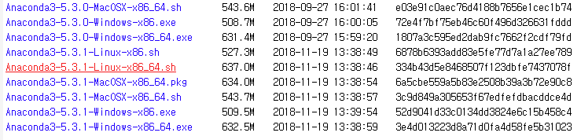
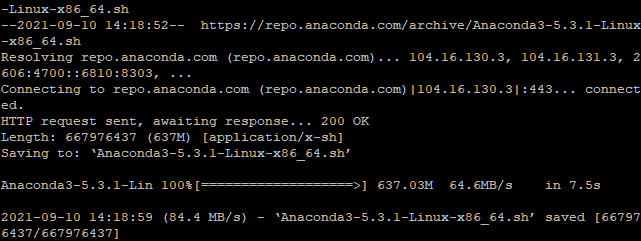
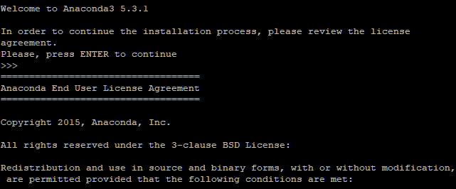
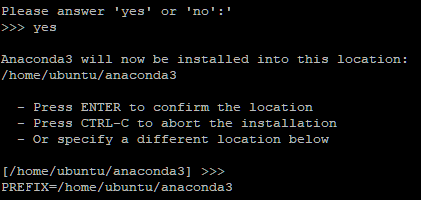
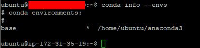

# 아나콘다 설치하기

> AWS 활용


### wget 명령어로 설치하기

##### 아나콘다 파일 다운로드

1.  사이트 접속

https://repo.continuum.io/archive/

2.  다운 받을 파일 선택

- 버전: 2번대 혹은 3번대 추천 (3.8.8)
- OS: Linux 버전
- 프로세스 타입: 32bit, 64bit 중 적합한 타입 (64bit)
- 날짜: 가장 최근 수정된 파일

2.  .sh로 끝나는 파일명 링크 주소 복사

- https://repo.anaconda.com/archive/Anaconda3-5.3.1-Linux-x86_64.sh



3. PuTTY 접속 후 명령어 입력

```shell
$ wget https://repo.anaconda.com/archive/Anaconda3-5.3.1-Linux-x86_64.sh
```




##### 아나콘다 설치

1. 설치 명령어 입력

- please answer 'yes' or 'no'가 나오면 'yes' 입력
- 경로 관련 내용이 나왔을 때 `Enter`를 누르고 기다리면 설치 진행

```shell
$ bash Anaconda3-5.3.1-Linux-x86_64.sh
```





- PREFIX = /home/ubuntu/anaconda3 라고 나왔을 때 설치가 끝난 줄 알고 다른 작업을 진행했다가 제대로 설치 되지 않음

  - 해결방법: 삭제하고 다시 설치하기

  ```shell
  $ rm -rf anaconda3
  ```


2. 아나콘다 생성 확인

```shell
$ conda info --envs
```



