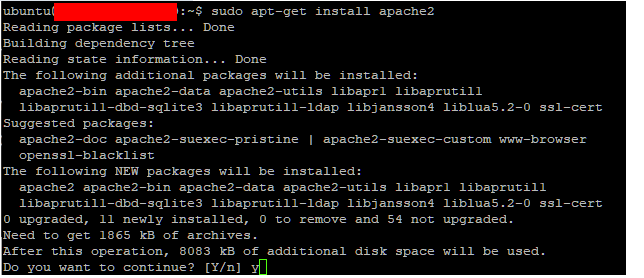
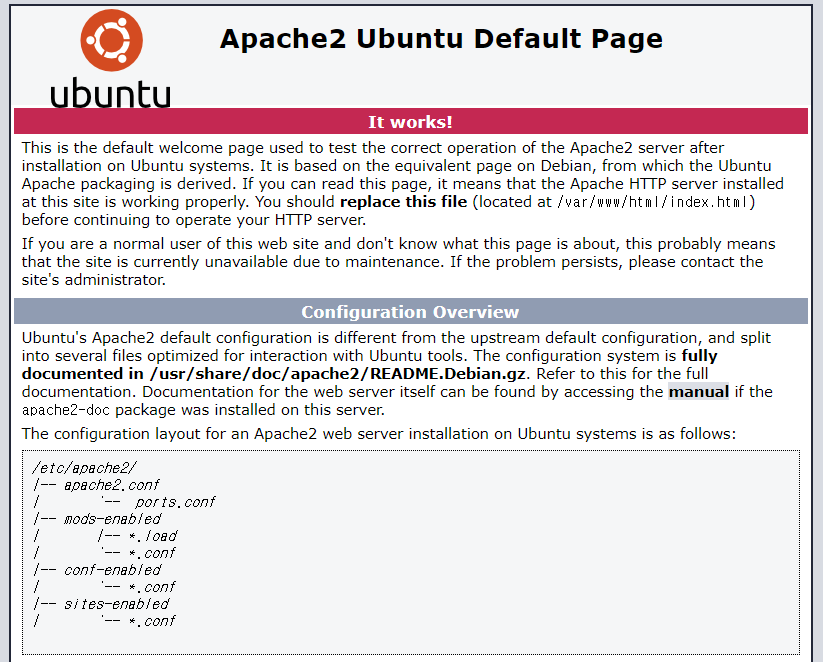
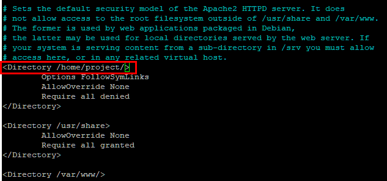
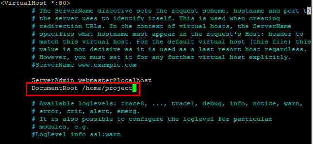
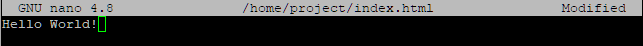
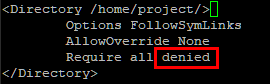
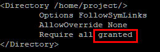

# Apache 웹 서버 설치 

> AWS 활용


##### Apache

월드와이드웹(WWW:World Wide Web) 서버용 소프트웨어


### Apache 웹 서버 설치

1. apache 설치하기

```shell
sudo apt-get install apache2
```



2. 웹 페이지 구동 확인하기

-  브라우저에 퍼블릭 IPv4 주소 입력



3. apache2.conf 설정 파일 열기

```shell
sudo nano /etc/apache2/apache2.conf
```

- 루트 디렉토리 변경



5. default.conf 설정 파일 열기

```shell
sudo nano /etc/apache2/sites-available/000-default.conf
```

- 루트 디렉토리 변경



6. project 폴더 생성

``` shell
sudo mkdir /home/project
```


7. index.html 파일 생성

```shell
sudo nano /home/project/index.html
```



8. Apache 웹 서버 재시작

```shell
sudo apachectl restart
```

9.  브라우저에 퍼블릭 IPv4 주소 입력


### 오류 해결

1. apache2.conf 설정 파일 확인

- denied를 granted로 수정 
  - `Require all granted`: 무조건 허용
  - `Require all denied`: 무조건 금지





2. Apache 웹 서버 재시작

```shell
sudo apachectl restart
```

3. 브라우저 확인


