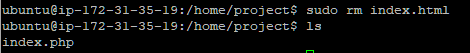

# Apache와 PHP 연동

> AWS 활용


### PHP 웹 서버 설치

1. php 설치

```shell
sudo add-apt-repository ppa:ondrej/php 
sudo apt-get update 
sudo apt-get install -y php5.6
```


2. PHP 버전 확인

```shell
php -version
```


3. index.php 파일 작성

```shell
sudo nano /home/project/index.php
```


4. index.html 파일 삭제

```shell
cd /home/project
```


- 파일 삭제
  - index.html 파일이 보호되어 있다고 나타남

```shell
rm index.html
```


```shell
sudo rm index.html
```



5. 브라우저 실행


