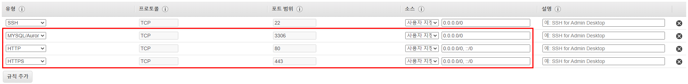
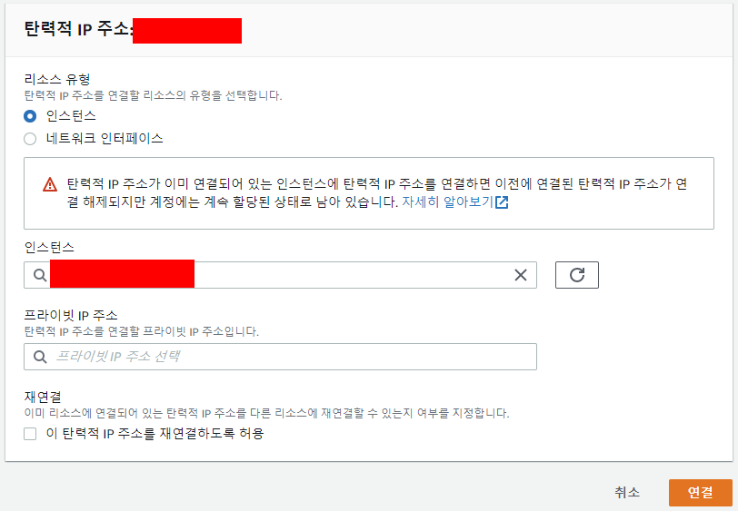
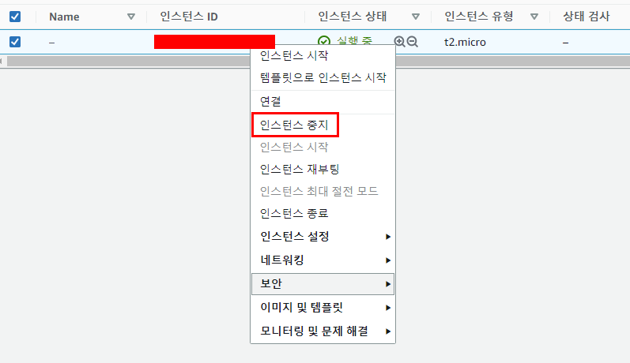

# EC2 인스턴스 생성

> AWS 활용

### 인스턴스 생성

https://docs.aws.amazon.com/ko_kr/AmazonRDS/latest/UserGuide/CHAP_Tutorials.WebServerDB.CreateWebServer.html

##### EC2

안전하고 크기 조정이 가능한 컴퓨팅 용량을 클라우드에서 제공하는 웹 서비스

##### 인스턴스 생성하기

1. EC2 서비스 검색

2. 인스턴스 > 인스턴스 시작 선택

3.  Amazon Machine Image(AMI) 선택

- 프리 티어 사용 가능한지 확인

4. 인스턴스 유형 선택

- 프리티어 사용 가능한지 확인

5. 인스턴스 세부 정보 구성 

- 기존에 만들었던 IAM 역할 지정

6. 스토리지 추가

- 크기로 지정할 수 있는 최대가 30이므로 30으로 변경

7. 보안 그룹 구성

- 사용할 규칙 추가
  - SSH: EC2서버 구축 후 제어하기 위한 포트 개방 (default)
  - MYSQL/Aurora: MySQL을 사용하기 위해 포트 개방
  - HTTP: 웹 서비스를 구현하기 위해 포트 개방
  - HTTPS: HTTP와 유사하지만 보안은 더 강화

8. 키 페어 생성 후 다운로드

9. 인스턴스 생성 확인

### 탄력적 IP 생성

https://docs.aws.amazon.com/ko_kr/AWSEC2/latest/UserGuide/elastic-ip-addresses-eip.html

##### 탄력적 IP

동적 클라우드 컴퓨팅을 위해 고안된 정적 IPv4 주소

##### 주의사항

- 탄력적 IP 주소의 효율적인 사용을 위해 탄력적 IP 주소가 실행 중인 인스턴스와 연결되어 있지 않거나 중지된 인스턴스 또는 연결되지 않은 네트워크 인터페이스와 연결된 경우 소액의 시간당 요금이 부과

##### 탄력적 IP 생성하기

1. 네트워크 및 보안 > 탄력적 IP 주소

2. 탄력적 IP 주소 할당 선택

3. 탄력적 IP 주소 할당

4. 탄력적 IP 주소 연결

- 인스턴스에 이전에 생성한 인스턴스 연결

5. 탄력적 IP 주소 연결 확인

### 인스턴스 중지

- 사용을 다 한 이후에는 인스턴스를 중지 시켜줌
- 중지했다가 새로 시작하면 퍼블릭 IP 주소가 변경됨

### 인스턴스 삭제

- 인스턴스가 실행중이라면 중지 후 삭제

