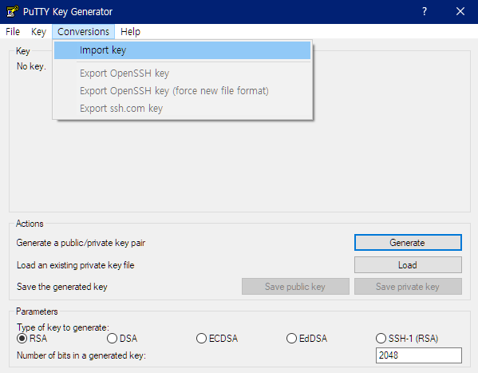

# EC2 서버 접속하기

> PuTTY 활용

### PuTTY 설치

##### PuTTY

SSH 및 텔넷 클라이언트

##### PuTTY 설치하기

1. 사이트 접속

https://putty.org/

2. 응용 프로그램 다운로드

3. PuTTY 실행하기

### Private Key 생성

1. PuTTYgen 설치

https://www.puttygen.com/download-putty

2. 탄력적 IP 주소를 생성할 때 얻은 .pem 파일 확인

3. PuTTYGen 실행 후 Conversions > Import key 선택

4. .pem 파일을 추가하고 Save private key 클릭

4. 확장자를 .ppk로 지정 후 저장

