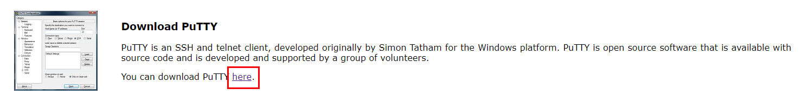
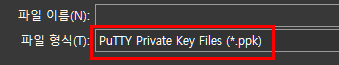

# EC2 서버 접속하기

> PuTTY 활용

### PuTTY 설치

##### PuTTY

SSH 및 텔넷 클라이언트

##### PuTTY 설치하기

1. 사이트 접속

https://putty.org/

2. 응용 프로그램 다운로드

3. PuTTY 실행하기

### Private Key 생성

1. PuTTYgen 설치

https://www.puttygen.com/download-putty

2. 탄력적 IP 주소를 생성할 때 얻은 .pem 파일 확인

3. PuTTYGen 실행 후 Conversions > Import key 선택

4. .pem 파일을 추가하고 Save private key 클릭

4. 확장자를 .ppk로 지정 후 저장

### PuTTY 설정하기

1. 탄력적 IP 주소 확인

- 앞서 할당 받은 IP 주소 복사

2. PuTTY에 IP address 설정

3. Connection > SSH > Auth 설정

- 앞서 생성한 .ppk 파일 업로드

4. Session > Saved Sessions 이름 지정 후 저장

5. 저장한 세션 선택 후 Open 클릭

6. Accept 선택

7. login 아이디 입력

- AMI에 따라 기본 계정이 다름

  https://docs.aws.amazon.com/ko_kr/AWSEC2/latest/UserGuide/managing-users.html

  - Amazon Linux 2 또는 Amazon Linux AMI의 경우:  `ec2-user`
  - CentOS AMI의 경우: `centos`
  - Debian AMI의 경우:`admin`
  - Fedora AMI의 경우: `ec2-user` 또는 `fedora`
  - RHEL AMI의 경우: `ec2-user` 또는 `root`
  - SUSE AMI의 경우: `ec2-user` 또는 `root`
  - Ubuntu AMI의 경우: `ubuntu`

