# IAM 계정 생성 및 권한 부여

> AWS 활용

### IAM(Identify and Access Management)

AWS의 자원에 대한 접근 권한을 가진 계정을 생성하는 서비스

### IAM 그룹 생성하기

1. IAM 서비스 접속

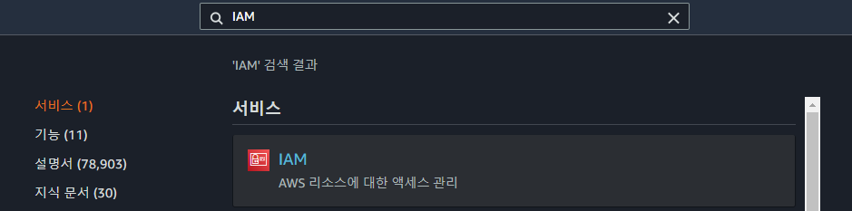

2. IAM > 개의 사용자 그룹> 그룹 생성 선택 

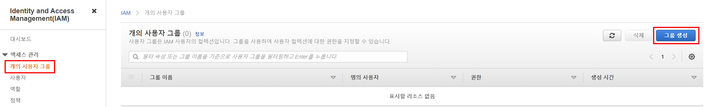

3. 사용자 그룹 생성

- 그룹 이름 지정

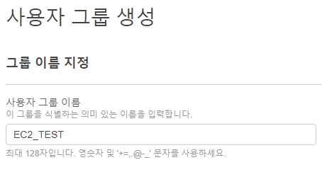

- 권한 정책 연결 > EC2Full 필터 > AmazonEC2FullAccess 선택 

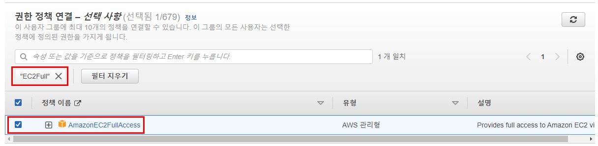

4. 그룹 생성 확인

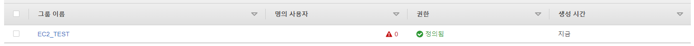

### 사용자 생성하기

1. 사용자 > 사용자 추가

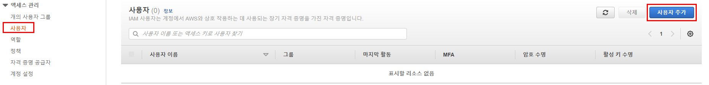

2. 사용자 이름을 입력하고 프로그래밍 방식 액세스 선택

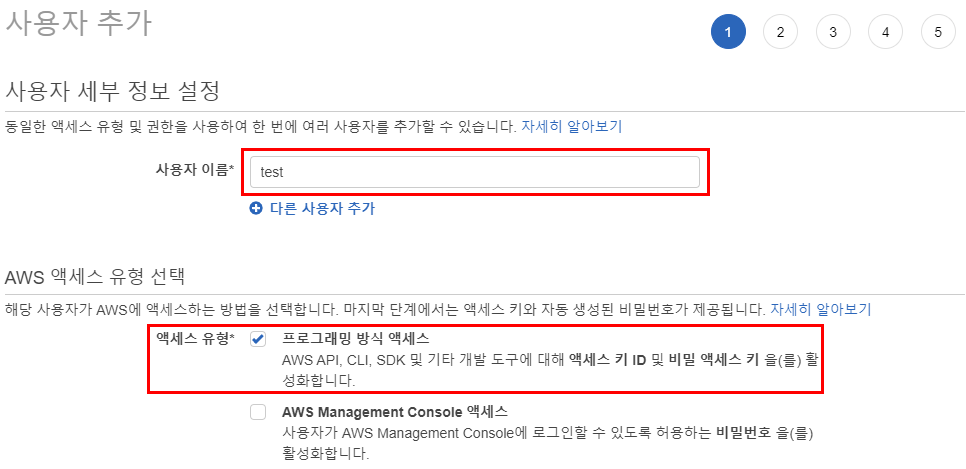

3. 그룹에 사용자 추가 > EC2_TEST 선택

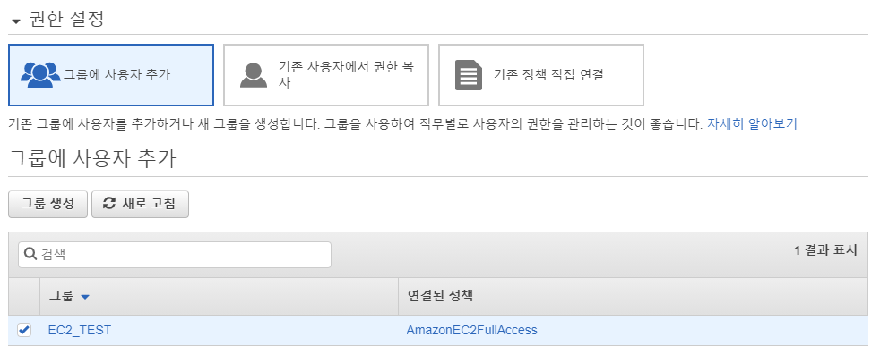

4. 선택 항목 검토 후 사용자 추가

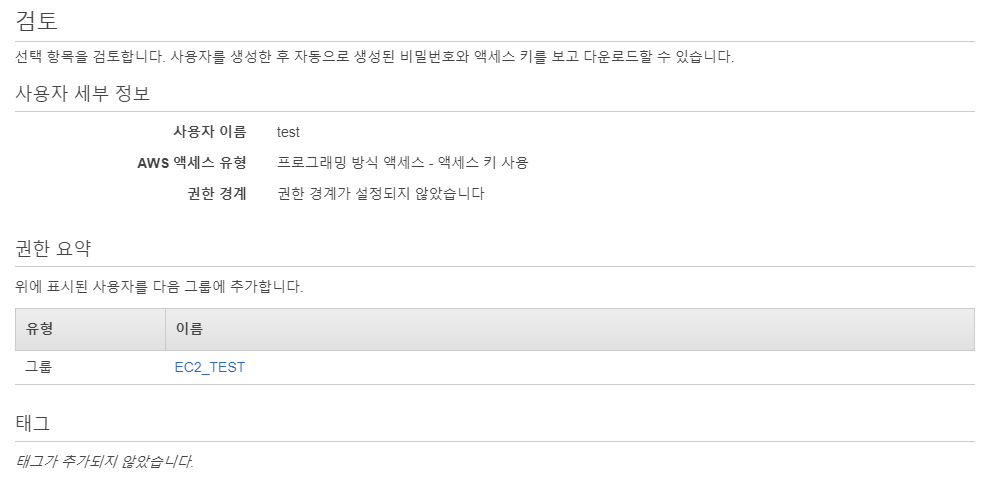

5. 사용자 생성이 성공하면 자격증명 다운로드 

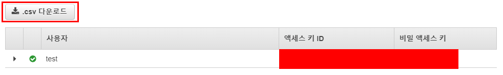

### 역할 생성하기

1. 역할 > 역할 만들기

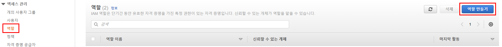

2. 일반 사용 사례에서 EC2 선택

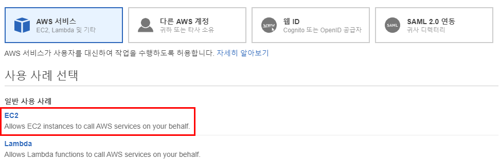

3. S3Full 검색 > AmazonS3FullAccess 선택

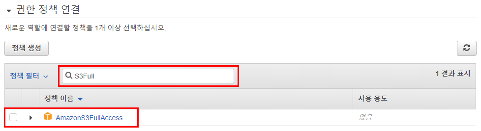

4. 역할 이름 추가해준 후 역할 생성

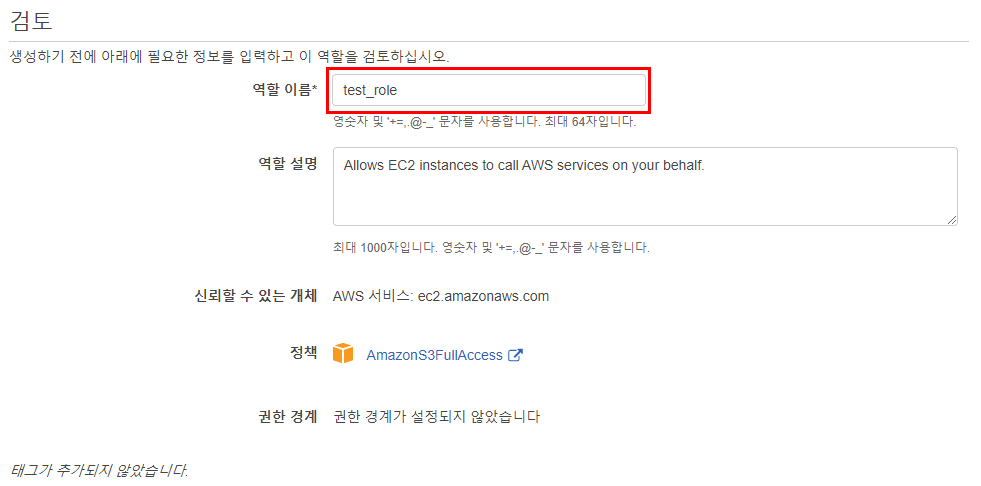

