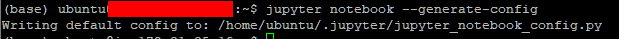
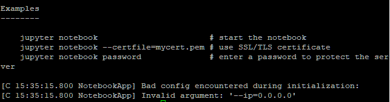
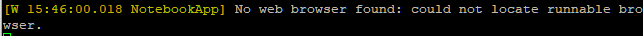
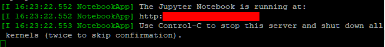

# Jupyter notebook 시작하기

> AWS 활용


### Jupyter 서버 구축

1. 가상환경 활성화 (base)

```shell
source activate base
```


2. 설정 파일 생성

```shell
$ jupyter notebook --generate-config
```



3. ipython 실행

```shell
cd .jupyter
```

```shell
ipython
```


4. 비밀번호 지정

- 생성된 sha1~ 암호 복사해두기

```shell
from notebook.auth import passwd
passwd()
```


5. ipython을 빠져나온 후 jupyter 설정 파일 수정

```shell
$ nano jupyter_notebook_config.py
```

- c.NotebookApp.password = 'sha1 암호'
- c.NotebookApp.ip = '프라이빗 IPv4 주소'
- c.NotebookApp.port = '8888'
- c.NotebookApp.notebook_dir = '/home/ubuntu/project'

6. jupyter notebook 실행

```shell
cd ~
mkdir project
jupyter notebook
```


- OSError: [Errno 99] Cannot assign requested address 에러 발생

  - 해결방법
    - jupyter notebook -–ip=0.0.0.0 -–port=8888 -–allow-root 해결 X
    - jupyter_notebook_config.py 재수정
    - 인바운드 규칙에 8888 추가

  

- 수정 후  No web browser found: could not locate runnable browser. 에러 발생




### 5번 과정 다시 진행 (오류 해결)

1.  jupyter 설정 파일 수정

```shell
$ nano jupyter_notebook_config.py
```

- c = get_config()
- c.NotebookApp.allow_origin = '*'
- c.NotebookApp.ip = '콘솔에 접속했을 때 이름 옆에 뜨는 ip 주소 = 프라이빗 IPv4 주소'
- c.NotebookApp.notebook_dir = '파일 저장 경로'
  - /home/ubuntu/project
- c.NotebookApp.open_browser = False
- c.NotebookApp.password = 'sha1:~'
- c.NotebookApp.port = 8888

2. jupyter notebook 실행

```shell
cd ~
jupyter notebook
```



3. 인터넷 주소 창에 `http://퍼블릭 IPv4 주소:port 번호/` 입력


