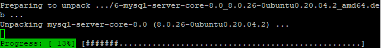
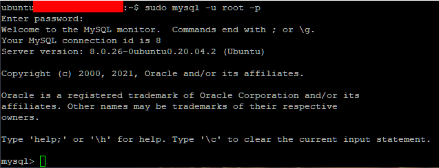
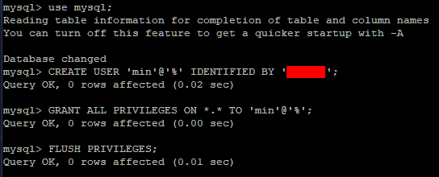
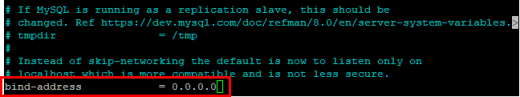
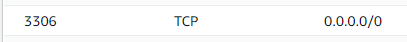
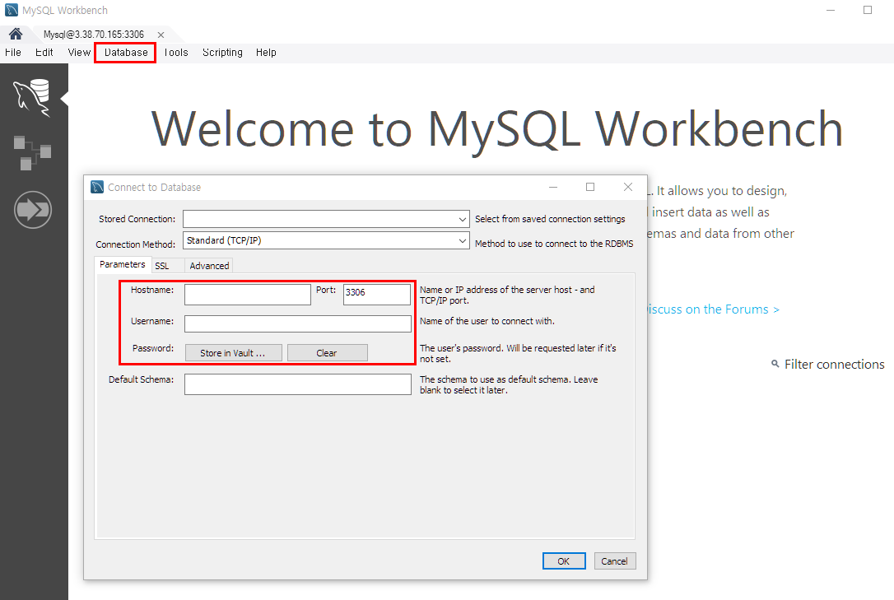

# MySQL 설치 및 외부 접속하기

> AWS 활용


### MySQL 설치하기

1. apt 업데이트

```shell
sudo apt updata
```

2. MySQL 서버 설치

```shell
sudo apt install mysql-server
```



3. MySQL 접속

```shell
sudo mysql -u root -p
```



4. 사용자 계정 생성

- 비밀번호를 지정해서 사용자 생성
  - CREATE USER '{사용자 이름}'@'%' IDENTIFIED BY '{비밀번호}'; 
- 외부 접속이 가능하도록 설정
  - GRANT ALL PRIVILEGES ON *.* TO '{사용자 이름}'@'%'; 
- 현재 사용중인 MySQL의 캐시를 지우고 새로운 설정을 적용
  - FLUSH PRIVILEGES; 



5. 설정파일 수정

- bind-address = 0.0.0.0

```shell
cd /etc/mysql/mysql.conf.d; 
sudo nano mysqld.cnf;
```



6. MySQL 재시작

```shell
sudo service mysql restart
```


### MySQL 외부 접속하기

##### 보안 그룹 확인

- 포트범위: 3306
- 프로토콜: TCP
- 원본: 0.0.0.0/0



##### MySQL 관리 도구 이용

- MySQL Workbench 사용


##### MySQL 외부 접속

1. Database > Connect to Database

2. 파라미터 입력

- Hostname: 퍼블릭 IPv4 주소
- Username: 사용자 이름
- Password: 비밀번호



