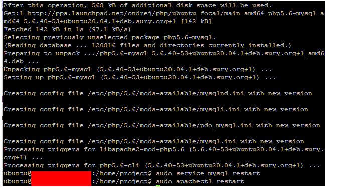
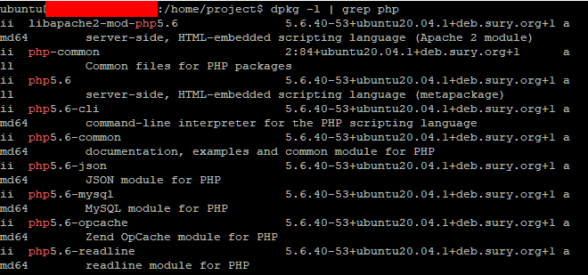
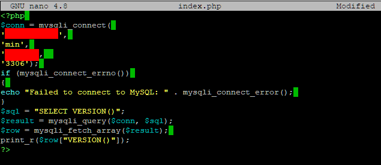
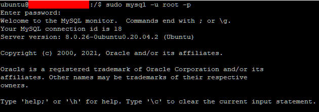
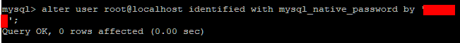
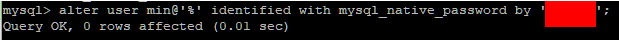
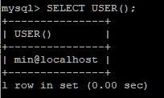
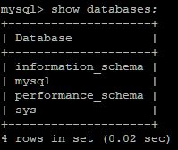
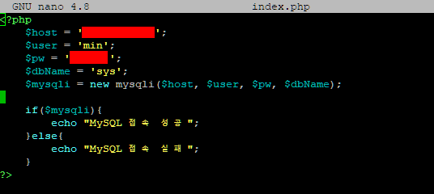
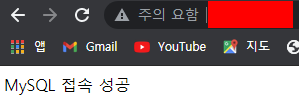

# MySQL과 PHP 연동

> AWS 활용


### MySQL 연동

1. MySQL 연동 라이브러리 설치

```shell
sudo apt install php5.6-mysql 
sudo service mysql restart 
sudo apachectl restart
```



2. 설치 패키지 확인

```shell
dpkg -l | grep php
```



3. index.php 코드 작성

```shell
sudo nano index.php
```

- '데이터베이스 IP (퍼블릭 IPv4 주소)', 
- '사용자 이름', 
- '비밀번호',
-  '데이터베이스 이름',
-  '3306');



4. 브라우저 실행


### 오류 해결 1번 방법 (실패)

1. MySQL 접속

```shell
sudo mysql -u root -p
```



2. 인증 방식 수정

```shell
alter user root@localhost identified with mysql_native_password by '비밀번호';
```



- 오류 해결 X

3. 인증 방식 재수정

```shell
alter user min@'%' identified with mysql_native_password by '비밀번호';
```



4. 인증방식 확인

```shell
SELECT user, host, plugin FROM mysql.user;
```


- 오류 해결 X


### 오류 해결 2번 방법 (성공)

1. min 유저로 접속

```shell
sudo mysql -u min -p
```



2. 생성되어 있는 데이터베이스 확인

```shell
show databases;
```



3. index.php 코드 수정

```shell
sudo nano index.php
```



4. 브라우저 확인

