# NoSQL 테이블 생성 및 쿼리

> Amazon DynamoDB
>
> https://aws.amazon.com/ko/getting-started/hands-on/create-nosql-table/

### NoSQL

빅데이터 처리를 위한 비관계형 데이터베이스 관리 시스템(DBMS)

##### DynamoDB

완전 관리형 클라우드 데이터베이스로서 문서 모델과 키-값 스토어 모델을 모두 지원

### NoSQL 만들기

1. 서비스 > DynamoDB 선택

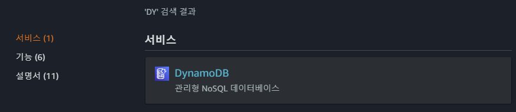

2. 테이블 생성 클릭

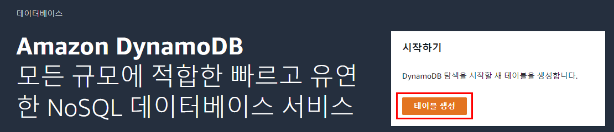

3. 테이블 세부 정보 지정

- 음악 라이브러리를 사용
  - 테이블 이름: 테이블을 식별하는 데 사용할 이름 설정
  - 파티션 키: 파티션을 특정하는 키(기본 키), 일치하는 값만 가져올 수 있음
  - 정렬 키: 정렬하는 기준 값(인덱스), 문자열, 숫자, 이진수 타입 지원

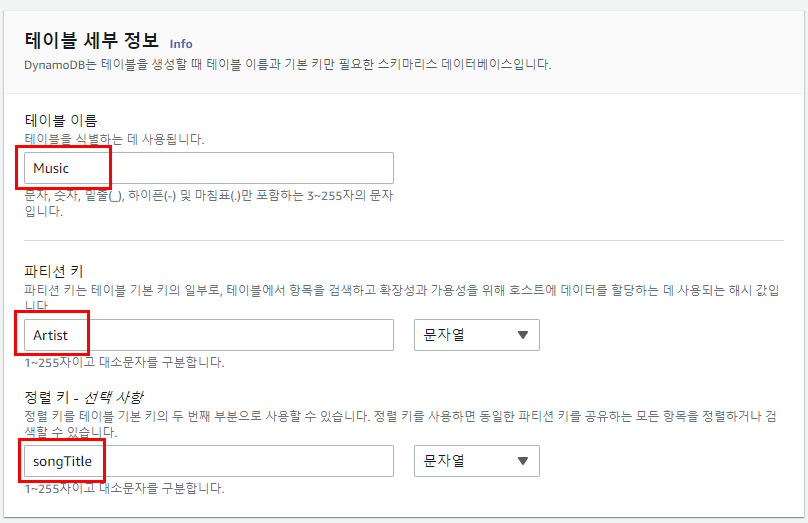

4. 설정 변경

- 기본 설정: 기본으로 제공되는 설정으로 테이블 생성
- 설정 사용자 지정
  - 온디맨드: 애플리케이션이 수행하는 실제 읽기 및 쓰기에 대해 요금 지불
  - 프로비저닝: 읽기/쓰기 용량을 미리 할당하는 방식으로 요금 관리

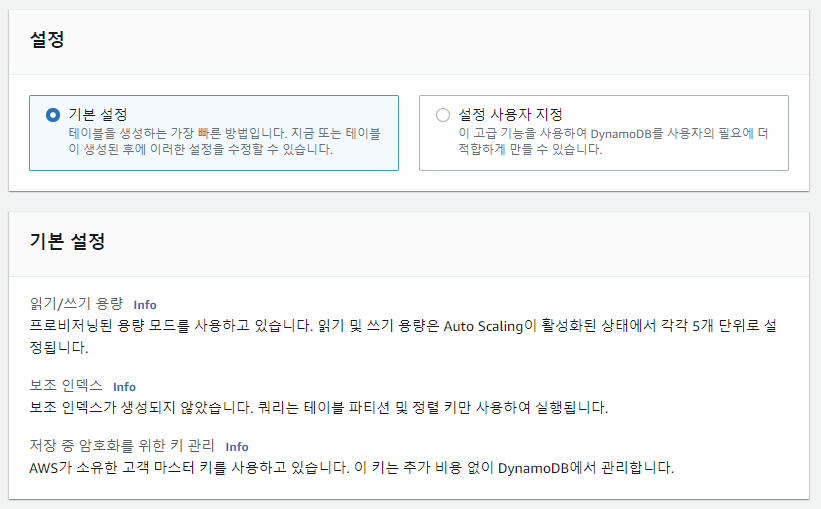

5. 테이블 생성 확인

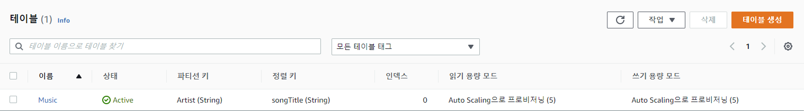

### 테이블에 데이터 추가하기

1.  DynamoDB > 항목 > 항목 생성 클릭

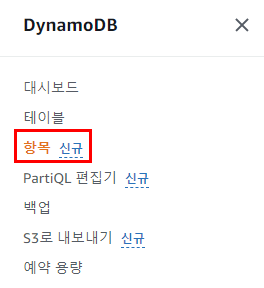

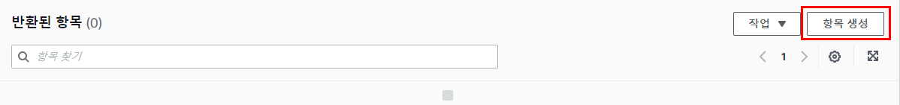

2. 속성 탭에 값 추가 후 항목 생성

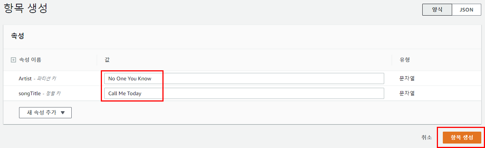

3. 생성된 항목 확인

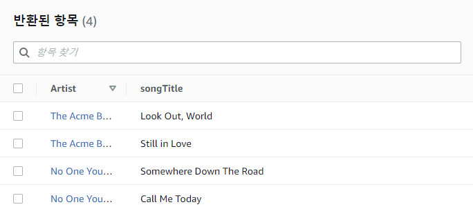

### 쿼리 실행하기

1. 상단 탭을 스캔 > 쿼리로 변경

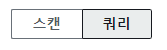

##### 파티션 키만 지정 후 실행

1. 파티션 키에 값 입력 후 실행

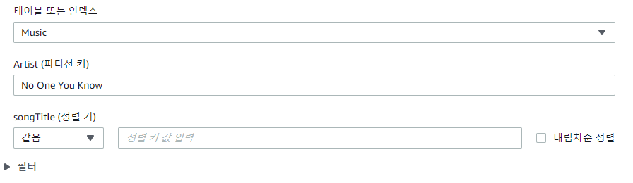

2. 실행 결과 확인

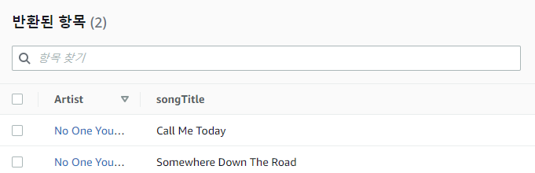

##### 정렬 키 지정 후 실행

1. 정렬 키에 값 입력 후 실행

- 같음, 보다 큼, 범위, 시작 문자 등을 선택할 수 있음

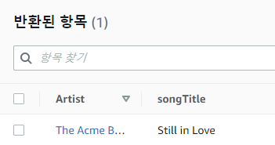

### 항목 삭제하기

1. 상단 탭을 쿼리 > 스캔으로 변경

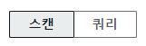

2. 항목 선택 후 작업 > 항목 삭제 선택

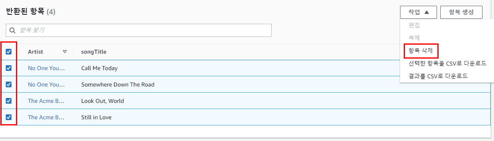

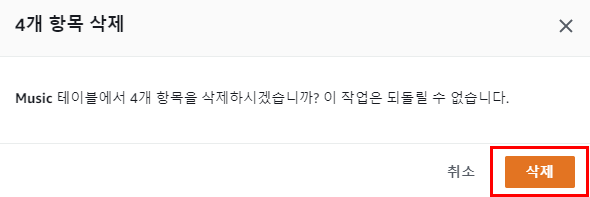

3. 삭제 결과 확인

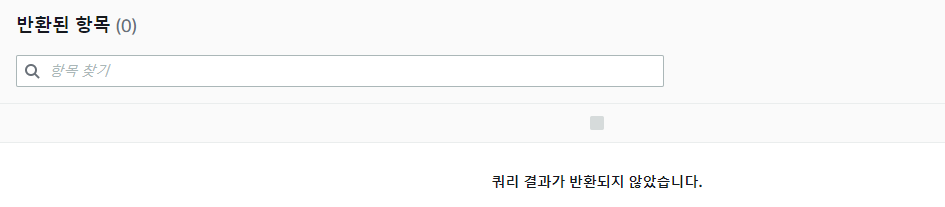

### 테이블 삭제하기

1.  DynamoDB > 테이블 클릭

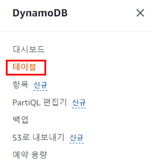

2. 테이블 선택 후 삭제 클릭

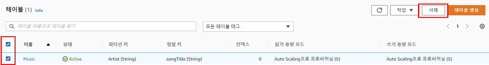

3. 삭제 입력 후 테이블 삭제 클릭

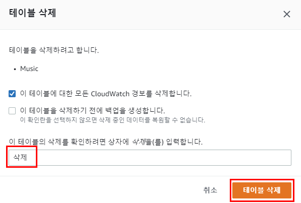

4. 테이블 삭제 확인

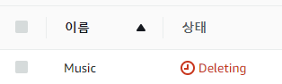

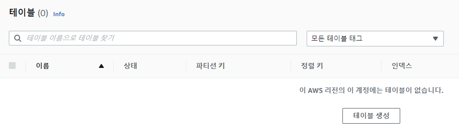

