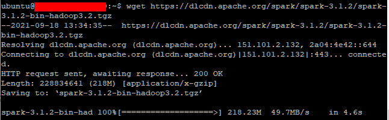

# Spark 설치 및  환경설정

> AWS 활용


### Spark 설치하기

##### scala 다운로드

1. scala 설치

```shell
$ sudo apt-get install scala
```


```shell
$ scala
```


2. 환경변수 설정

```shell
$ sudo nano etc/profile
```


##### spark 다운로드

1. 버전을 선택하고 spark-3.1.2-bin-hadoop3.2.tgz 클릭

https://spark.apache.org/downloads.html


2. 주소를 복사해서 다운로드


```shell
$ wget https://dlcdn.apache.org/spark/spark-3.1.2/spark-3.1.2-bin-hadoop3.2.tgz
```



3. 다운받은 파일 압축 풀기

```shell
$ tar xvf spark-3.1.2-bin-hadoop3.2.tgz
```


4. spark 위치 이동

```shell
$ sudo mv spark-3.1.2-bin-hadoop3.2/ /usr/spark
```

5. spark 환경변수 설정

```shell
$ sudo nano etc/profile
```


6. spark 설치 확인

```shell
$ /usr/spark/bin/spark-shell
```


```shell
println("spark is running")
```


