# JAVA 설치 및 환경설정

> AWS 활용


### 자바 설치하기

##### openjdk 설치

```shell
$ sudo apt-get install openjdk-8-jdk
```

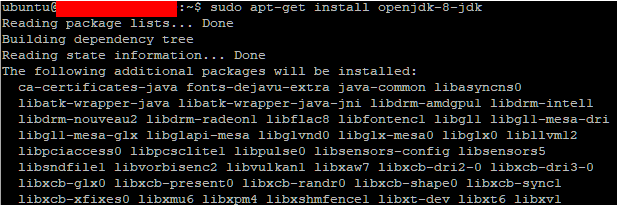

##### 자바 설치 확인

```shell
$ java -version
```

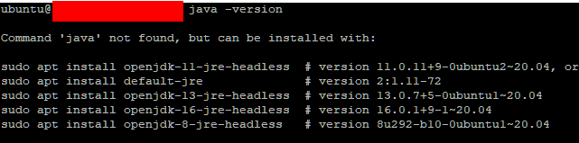

- java를 찾을 수 없다고 나타남

1. 설치할 수 있는 openjdk 목록 확인

```shell
$ apt search openjdk
```

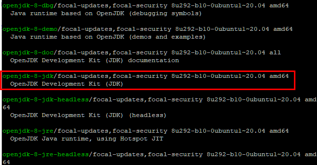

2. 목록에 없다면 여러 버전 추가

```shell
$ sudo add-apt-repository ppa:openjdk-r/ppa
```

3. 패키지 업데이트

```shell
$ sudo apt-get update
```

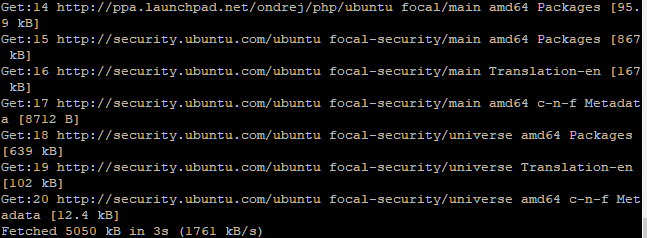

3. 설치 재 실행

```shell
$ sudo apt install openjdk-8-jdk
```

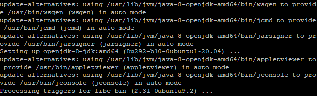

4. 자바 버전 확인

```shell
$ java -version
```

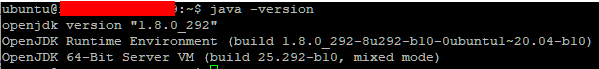


### 자바 환경설정 하기

1. 자바 위치 확인

```shell
$ which java
```

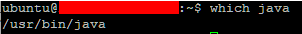

```shell
$ readlink -f /usr/bin/java
```

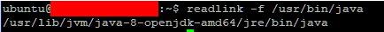

- /bin/java를 제외한 경로 복사
  - /usr/lib/jvm/java-8-openjdk-amd64/jre

2. 환경설정 파일 열기

- export JAVA_HOME=/usr/lib/jvm/java-8-openjdk-amd64/jre
  export PATH=$JAVA_HOME/bin:$PATH
  export CLASS_PATH=$JAVA_HOME/lib:$CLASS_PATH

```shell
$ sudo nano /etc/profile
```

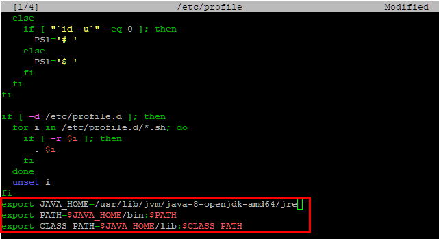

3. 파일 업데이트

```shell
$ source /etc/profile
```

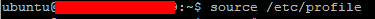

4. 환경변수 셋팅 확인

```shell
$ echo $JAVA_HOME
```

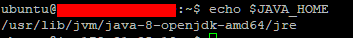